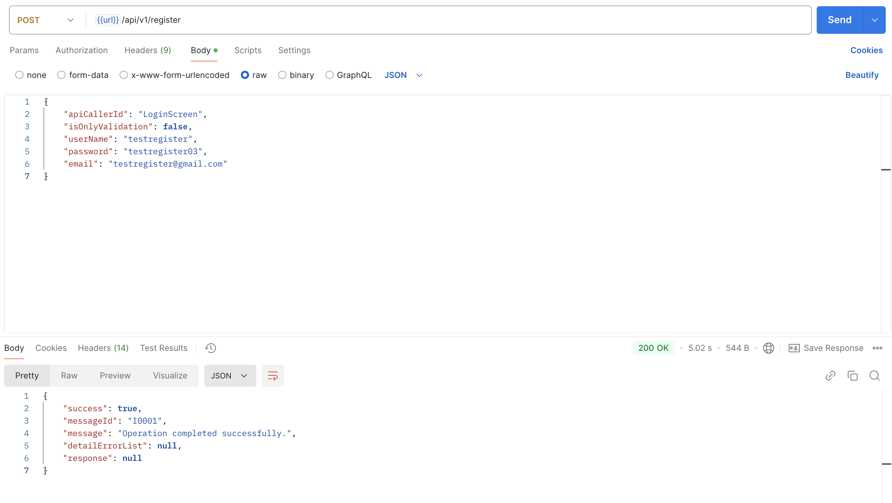
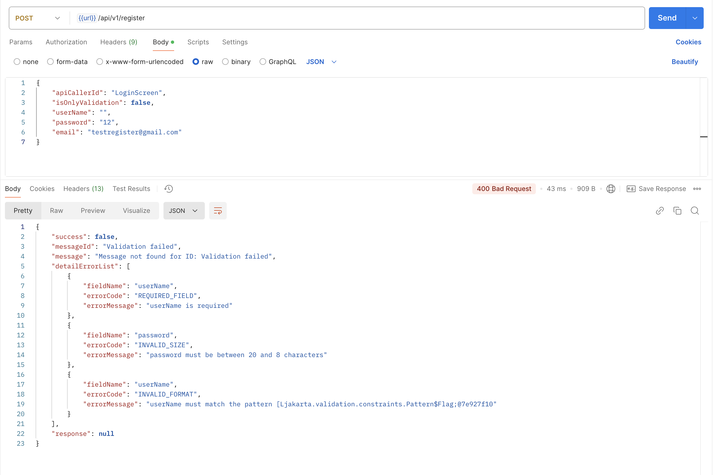

## 🛒 Personal Store Management Project
## 🌟 Overview
This project is a personal store management system built using modern Java technologies. It provides APIs for various store operations, including:
- 🔐 User authentication using JWT
- 🛍️ Product management (CRUD operations)
- 📦 Order processing and tracking
- 🚦 Role-based access control (Admin, Staff, Customer)
---

## 🛠️ Tools and Technologies Used
- Java
- Spring Boot
- Maven
- JPA/Hibernate
- JWT for authentication
- MS SQL Server
- Docker
- Swagger
- Postman
- Git
---
## Project Structure
src  
├── main  
│   ├── java  
│   │   └── project  
│   │       └── personal  
│   │           └── personalstoremanagementproject  
│   │               ├── controllers           # REST APIs  
│   │               │   ├── v1                # Version 1 APIs  
│   │               │       ├── AbstractApiController  
│   │               │       ├── AbstractApiRequest  
│   │               │       └── AbstractApiResponse  
│   │               ├── common                # Common utilities and shared logic  
│   │               ├── configuration         # Application configurations  
│   │               ├── entities             # Database models  
│   │               ├── exceptions           # Custom exception handling  
│   │               ├── repositories         # Data access layer  
│   │               ├── services             # Business logic  
│   │               └── utils                # Utility classes  
│   └── resources  
│       ├── application.properties           # Application configuration file  
│       └── constantCsv                      # CSV files for constants  
│  
└── test  
└── java  
└── project  
└── personal  
└── personalstoremanagementproject

<h2>
     Architecture of the project
</h2>

---

## 🌟 Features
### 🛠️ Core Features
1. User Management: Register, login, and manage user profiles.
2. Product Management:
Add, update, delete, and view products.
3. Order Processing:
Create and manage orders, track status.
4. Security:
Authentication using JWT.
Role-based access control (e.g., Admin, Customer).
### 🚀 Planned Features
📊 Generate sales reports. 
📈 Dashboard with analytics. 
🌐 Multi-language support.

## 🚀 Getting Started
# 🚀 How to Run
### 1. Clone the repository or docker pull the image ###
- Clone Dockerhub: docker pull giakhoi221203/api-db-personalstoremanagement
- Clone Github: https://github.com/giakoii/SpringBoot-PersonalStoreManagement.git
### 2. Create database MS SQL database ###
- Use file database.txt 
- Create database name: PersonalStoreManagement
---
## 📖 API Documentation
Detailed API documentation is available in the Swagger UI:

Access Swagger: http://localhost:2003/swagger-ui.html

----

## 📖 API request and response sample

### 🛠️ User Registration success and failure

  
  

