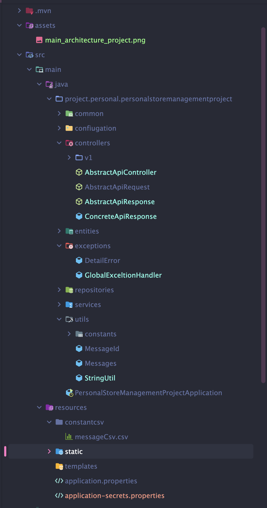

# SpringBoot-personal-store-management
This is a simple project to manage a personal store using Spring Boot, Spring Data JPA, Spring Security, Thymeleaf, and MS SQL.

<h2>
     Architecture of the project
</h2>

    

